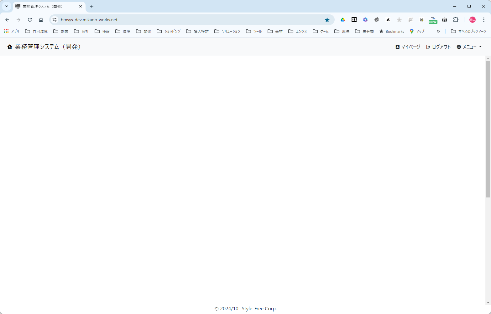

<link href="./style.css" rel="stylesheet"></link>

# 【画面の基本レイアウト】

## ■ パラメータ

### 入力

特になし

### 出力

特になし

## ■ イメージ

  
  

    
(1)
      
(1-1)

    

    
(2)
      
(2-1)

      
(2-2)

      
(2-3)

    

    
(3)
      
(3-1)

    

    
(4)
      
(4-1)

    

  

| No  | 項目名             | ラベル                      | 型     | 横配置   | 説明                                                                                                     |
| --- | ------------------ | --------------------------- | ------ | -------- | -------------------------------------------------------------------------------------------------------- |
| 1   | ページ・ヘッダ     | なし                        | パネル |          | 共通の画面ヘッダー部分。画面上部の左側に配置。                                                           |
| 1-1 | システム・タイトル | （システム名）              | リンク | 左寄せ   | システムのタイトルの表示とシステムホームへのリンク                                                       |
| 2   | アクション・ヘッダ | なし                        | パネル |          | システムに対する操作アイコン群およびメニュー表示。画面上部の右側に配置。                                 |
| 2-1 | マイページ         | マイページ                  | リンク | 右寄せ   | マイページ画面へのリンク                                                                                 |
| 2-2 | ログアウト         | ログアウト                  | ボタン | 右寄せ   | ログイン中の場合、ログアウト処理を実行する                                                               |
| 2-3 | メニュー           | メニュー                    | ボタン | 右寄せ   | システムのメイン・メニューをプルダウン表示する                                                           |
| 3   | コンテンツ         | なし                        | パネル |          | 画面固有の UI コンテンツの表示。 縦にあふれた場合はスクロールバーを表示し、横方向にはあふれず折り返す |
| 3-1 | 通知メッセージ     | なし                        | パネル |          | メッセージを表示する。メッセージの内容に従って縦方向に領域を拡張する。                                   |
| 4   | フッター           | なし                        | パネル |          | 画面下部に配置                                                                                           |
| 4-1 | 著作権             | © 2024/10- Style-Free Corp. | ラベル | 中央寄せ | 固定文言を表示                                                                                           |

## ■ 処理仕様

### 画面表示

- ◇ 未ログインの場合は、下記のようにする。

  - □ 表示しようとする画面がログイン必須の個別画面である場合、認証画面に遷移する

    | 入力パラメータ       | 値                           |
    | -------------------- | ---------------------------- |
    | ログイン後遷移先画面 | 表示しようとした画面のＵＲＬ |

  - □ 下記項目を非表示にする。

    - ログアウト
    - メニュー

  - ◇ ログイン済の場合は、下記のようにする。

  - 下記の項目を表示する
    - ログアウト
    - メニュー

### 「(1-1)システム・タイトル」クリック

- システムの「トップ」画面に遷移する。

### 「(2-1)マイページ」クリック

- ◇ 未ログインの場合、認証画面に遷移する。

  | 入力パラメータ       | 値                         |
  | -------------------- | -------------------------- |
  | ログイン後遷移先画面 | 「マイページ」画面のＵＲＬ |

### 「(2-2)ログアウト」クリック

- ログアウトして、「トップ」画面に遷移する。

### 「(2-3)メニュー」クリック

- メイン・メニューをプルダウン表示する。
