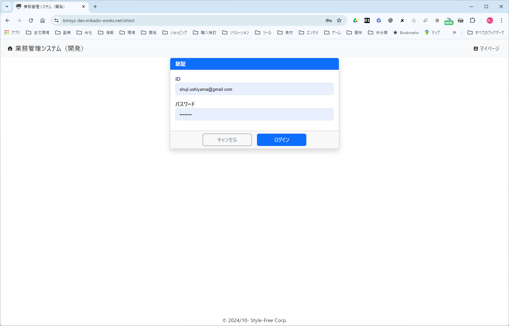

<link href="./style.css" rel="stylesheet"></link>

# 【認証画面】

## ■ パラメータ

### 入力

| No  | パラメータ名           | 物理名       | 型     | 必須 | 説明                                   |
| --- | ---------------------- | ------------ | ------ | ---- | -------------------------------------- |
| 1   | ログイン後遷移先画面   | logined.url  | 文字列 |      | ログイン成功後に遷移する画面のＵＲＬ   |
| 2   | キャンセル時遷移先画面 | canceled.url | 文字列 |      | キャンセルした際に遷移する画面のＵＲＬ |

### 出力

特になし

## ■ イメージ

  
  

      
(1)
        
(1-1)

        
(1-2)

        
(1-3)

        
(1-4)

      

  

| No  | 項目名               | ラベル     | 型       | 説明                                                                   |
| --- | -------------------- | ---------- | -------- | ---------------------------------------------------------------------- |
| 1   | 認証モーダル         | 認証       | パネル   |                                                                        |
| 1-1 | ログインＩＤ         | ID         | テキスト | 認証用 ID を入力する                                                   |
| 1-2 | ログイン・パスワード | パスワード | テキスト | 認証用パスワードを入力する                                             |
| 1-3 | キャンセル           | キャンセル | ボタン   | ログインをキャンセルする。キャンセル後はシステムホームに遷移する。     |
| 1-4 | ログイン             | ログイン   | ボタン   | ログイン ID とログイン・パスワードで認証を実行し、個別画面に遷移する。 |

## ■ 入力バリデーション

### 項目チェック

特になし

### 相関チェック

1. 「ログインＩＤ」と「ログイン・パスワード」を条件に、利用者テーブルの有効な利用者が存在している事
   - ＩＤ かパスワードが間違っているか確認してください。

## ■ 処理仕様

### 「(1-4)ログイン」クリック

- 下記の条件にて利用者を抽出する

      利用者．メールアドレス ＝ (1-1)ログインＩＤ
      利用者．パスワード ＝ (1-2)ログイン・パスワード
      利用者．削除済フラグ ＝ 0:未削除　※固定値
      利用者．入社日 ≦ 現在日

  - ◇ 一致する利用者を抽出できない場合、下記のメッセージを通知し処理を終了する

- ◇「1.ログイン後遷移先画面」入力パラメータが指定されている場合
  - 指定された値のＵＲＬへリダイレクトする。
- ◇「1.ログイン後遷移先画面」入力パラメータが指定されていない場合
  - 「トップ」画面に遷移する。

### 「(1-3)キャンセル」クリック

- ◇「2.キャンセル時遷移先画面」入力パラメータが指定されている場合
  - 指定された値のＵＲＬへリダイレクトする。
- ◇「2.キャンセル時遷移先画面」入力パラメータが指定されていない場合
  - 「トップ」画面に遷移する。
